# 知识入库工作流（责任链）

> **执行 SSOT**：Agent 必须按链顺序执行，**不可跳过 Handler**。  
> **Skill 入口**：`.cursor/skills/knowledge-ingest/SKILL.md`  
> **Schema**：[`KNOWLEDGE_SCHEMA.md`](KNOWLEDGE_SCHEMA.md) · **模块**：[`MODULES.md`](MODULES.md)

## 总览

```mermaid
flowchart LR
  U[用户输入] --> H01
  H01[Intake] --> H02[Dedup]
  H02 --> H03[Research]
  H03 --> H04[Classify]
  H04 --> H05[Decompose]
  H05 --> H06[Structure]
  H06 --> H07[Persist]
  H07 --> H08[Index]
  H08 --> H09[CrossLink]
  H09 --> H10[Validate]
  H10 --> H12[Publish]
  H12 --> H11[Report]
  H11 --> D[交付用户]
```



## Handler 责任链

| ID | 名称 | 输入 | 输出 | 失败处理 |
|----|------|------|------|----------|
| **H01** | Intake 接收 | 用户消息 | `IngestRequest` | 无内容 → 向用户索要链接/正文 |
| **H02** | Dedup 去重 | `IngestRequest` | `DedupReport` | 高度重复 → `action=merge`，定位目标笔记 |
| **H03** | Research 调研 | `IngestRequest` | `EnrichedContext` | 链接失效 → 仅用用户粘贴内容并标注 |
| **H04** | Classify 分类 | `EnrichedContext` | `ModuleAssignment[]` | 跨模块 → `action=split` 多模块 |
| **H05** | Decompose 拆解 | `EnrichedContext` | `KnowledgeAtom[]` | 过于笼统 → 追问用户或标注 draft |
| **H06** | Structure 结构化 | Atoms + 模板 | `DraftNote[]` | Schema 缺字段 → 补全后再过 |
| **H07** | Persist 持久化 | `DraftNote[]` | 文件路径列表 | 路径冲突 → 追加后缀 `-2` |
| **H08** | Index 索引 | 文件路径 | 更新 `INDEX.md` | 统计不一致 → 重算篇数 |
| **H09** | CrossLink 交叉引用 | 笔记 id 列表 | 更新 related | 无相关 → 跳过 |
| **H10** | Validate 校验 | 全部变更 | `ValidationReport` | 失败 → 回 H06 修复 |
| **H12** | Publish 提交推送 | 校验通过的变更 | `PublishReport` | 推送失败 → H11 标注，不阻断交付 |
| **H11** | Report 报告 | 全链路产物 | `IngestReport` + 用户摘要 | — |

---

## H01 · Intake 接收

**职责**：解析用户意图，生成入库单。

**检查清单**：
- [ ] 提取来源（URL / 粘贴 / 文件路径）
- [ ] 记录用户指定的 module / tags / action
- [ ] 生成 `ingest_id`：`ING-{YYYYMMDD}-{当日序号}`
- [ ] 若仅有标题无正文 → **停止链**，请用户补充

**输出示例**：
```yaml
ingest_id: ING-20260608-001
source: { type: url, value: "https://..." }
user_hint: { module: null, tags: [], action: null }
```

---

## H02 · Dedup 去重

**职责**：避免重复入库。

**执行**：
1. 读 `docs/INDEX.md` 全表
2. `grep -ri` 在 `notes/` 搜索标题关键词、tags、核心术语
3. 相似度判断：
   - **≥80%** 同主题 → `action=merge`，记录 `target_note_id`
   - **40–80%** → 新建但 `related` 链接
   - **<40%** → `action=create`

**输出**：`DedupReport { similar_found, candidates[], recommended_action }`

---

## H03 · Research 调研

**职责**：补充与核实外部知识。

**执行**：
- URL → WebFetch 拉正文
- 术语不明 → WebSearch 查官方文档
- 记录 `source.accessed` 日期
- **不**整篇搬运，只为 H05 拆解提供素材

---

## H04 · Classify 分类

**职责**：分配到 registry 模块。

**执行**：
1. 读 [`knowledge/registry.yaml`](../knowledge/registry.yaml)
2. 对每条内容按 `keywords` 打分
3. 用户 `user_hint.module` 优先，冲突时在 Report 说明
4. 跨模块 → 返回多个 `ModuleAssignment`，触发 split

---

## H05 · Decompose 拆解

**职责**：将长文拆为可检索的知识原子。

**原则**：
- 每个 Atom = 一个可独立回答的问题/技巧
- 3–10 个 Atom 为宜
- 保留可执行片段（命令、配置、代码）

---

## H06 · Structure 结构化

**职责**：按 Schema 生成 DraftNote。

**必读**：
- [`docs/KNOWLEDGE_SCHEMA.md`](KNOWLEDGE_SCHEMA.md)
- [`templates/article.md`](../templates/article.md)

**必填**：frontmatter 全部字段 + TL;DR + 适用场景 + 知识要点 + 变更记录

---

## H07 · Persist 持久化

**职责**：写入目标模块目录。

**路径**：`notes/{module}/{YYYY-MM-DD}-{slug}.md`

**规则**：
- merge → 更新已有文件，变更记录追加一行
- create → 新建文件
- split → 每个模块一个文件

---

## H08 · Index 索引

**职责**：更新 [`docs/INDEX.md`](INDEX.md)。

**必须更新**：
- 对应分类表格新增/更新行（含 `KB-*` id）
- 顶部统计篇数
- 标签云（新 tag 追加）
- 「最近更新」表

---

## H09 · CrossLink 交叉引用

**职责**：建立知识图谱。

- 新建笔记 `related` 填入关联 `KB-*` id
- **双向更新**关联笔记的 `related` 与「相关链接」章节

---

## H10 · Validate 校验

**职责**：质量门禁。

**执行**：
```bash
scripts/validate-note.sh notes/{module}/{file}.md
```

**人工检查清单**：
- [ ] frontmatter 完整
- [ ] TL;DR ≥ 3 条
- [ ] 无密钥/Token
- [ ] 原文链接有效或标注「链接失效」
- [ ] INDEX 行与文件路径一致

**失败** → 回到 H06，不得进入 H12。

---

## H12 · Publish 提交推送

**职责**：H10 通过后，将本次入库变更自动 commit 并 push 到远程。

**执行**：
```bash
scripts/publish-ingest.sh {ingest_id} "{笔记标题}" {file1} [file2...]
```

**必须纳入提交的文件**（仅本次入库相关，禁止 `git add -A`）：
- H07 新建/更新的 `notes/{module}/*.md`
- H08 更新的 `docs/INDEX.md`
- H09 交叉引用时改动的关联笔记

**提交信息格式**：`docs(ingest): {标题}` + 正文含 `{ingest_id}`

**默认远程**：`origin`（Gitee：`https://gitee.com/DestOwen/ai-study-center.git`）

**跳过条件**（仅当用户显式要求）：
- 用户消息含 `不要推送` / `--no-push` / `仅本地`
- 否则 **必须执行** H12

**失败处理**：
- 无 `origin`、认证失败、网络错误 → 记录原因，H11 报告 `publish: failed`
- 不得因推送失败回滚已写入的笔记

---

## H11 · Report 报告

**职责**：向用户交付入库结果。

**使用模板**：[`templates/ingest-report.md`](../templates/ingest-report.md)

**回复必须包含**：
1. ingest_id、action、module
2. 新建/更新的文件路径
3. TL;DR ≤ 3 条
4. 去重/合并说明（如有）
5. H12 推送结果（commit hash / 失败原因 / 已跳过）

---

## 触发词（自动启动责任链）

用户消息含以下任一即启动完整链路：

`整合` · `收录` · `入库` · `知识库` · `学习笔记` · `帮我整理` · `文章` · `/ingest`

也可显式调用：**`/ingest [链接或正文]`**

---

## 查询工作流（只读，不入库）

用户问「项目里有没有 X」→ 只执行 **H02 Dedup** 子流程 + 摘要回复，不写文件。

| 触发词 | 行为 |
|--------|------|
| `查询` · `有没有` · `搜索笔记` | H02 only |
| `整合` · `收录` · `/ingest` | H01–H12 全链（H11 报告在 H12 之后） |
