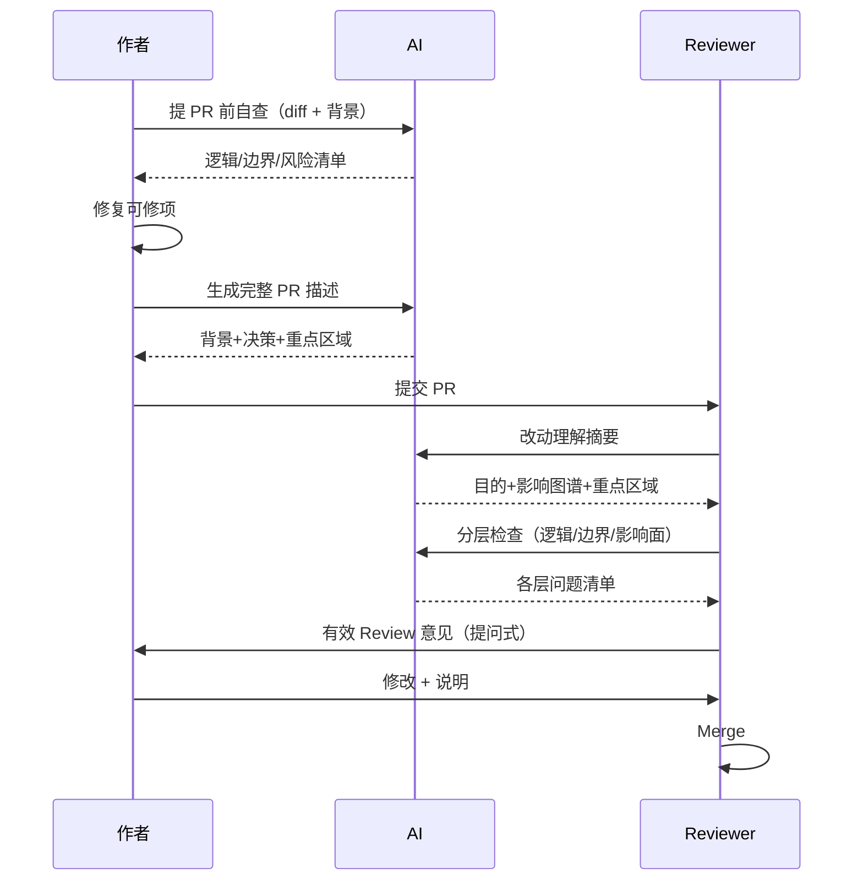

# AI 辅助 Code Review 方法论：提 PR 前自查、分层检查与有效意见

## TL;DR

- 多数团队 CR 退化为「走流程」的根因是**信息不对称**：Reviewer 只有 diff + 一句话 PR 描述，却要判断逻辑、边界、并发、影响面——用不完整信息做完整判断，只能「看起来没问题」。
- 三种失效模式：**只看风格**（lint 能查）、**只看新增不看影响**（连带 bug 高发）、**只有作者懂上下文**（「为什么这么写」从未被 Review 触及）。
- **好 Review 从提 PR 前开始**：作者先用 AI 自查逻辑/边界/异常/一致性/性能，修掉能修的再提交。
- Reviewer 侧：**先让 AI 生成改动理解摘要**（目的、影响图谱、重点区域），再分层检查——业务逻辑 → 异常边界 → 连带影响，而非「整体扫一遍」。
- AI 不替代 Reviewer，而是帮**作者与 Reviewer 两端**补齐上下文；企业级自动化流水线见 [架构专文](2026-06-08-ai-business-code-review.md)，通用 Prompt 模板见 [实战指南](2026-06-08-ai-code-review-prompt-guide.md)。

## 适用场景

**何时用：**

- PR 经常「LGTM」但上线后 bug 仍在 diff 里——想从流程上提高 Review 命中率。
- Reviewer 时间紧，需要在有限时间内聚焦高价值问题（逻辑、影响面），而非风格 nit。
- 作者希望提 PR 前自检，减少往返修改轮次。
- 团队愿意在 PR 描述中写清「为什么」与「重点 Review 区域」。

**何时不用：**

- 仅需 lint/格式门禁——用 ESLint、Sonar 等静态工具即可，不必上全套 AI 工作流。
- 已有企业级 Webhook + RAG 审计——在流水线之上仍可采纳本篇**作者自查 + 分层检查**的人机协作习惯。
- 期望 AI 代替人工签字——关键路径与业务规则仍需人确认。

## 知识要点

### 1. 为什么 Code Review 越来越难

Reviewer 通常只有：

- 几十到几百行 diff
- 一句 PR 描述（如「实现退款功能」）
- **零系统上下文**

却要判断：逻辑漏洞、边界完整性、并发/一致性、异常路径、对其他模块的影响。

**结论**：难在信息不对称，不在代码复杂度本身。

### 2. 三种失效模式

| 模式 | 表现 | 问题 |
|------|------|------|
| 只看风格 | 注释、命名、格式 | lint 已覆盖，Review 价值最低 |
| 只看新增 | 新代码很细，旧逻辑影响不看 | 多数线上 bug 来自「连带」 |
| 只有作者懂上下文 | Reviewer 看不懂「为什么这样写」 | 真正风险在动机与取舍，从未被讨论 |

### 3. 提 PR 前：作者 AI 自查（非代替 Review）

**目的**：作者在提交前修掉 AI 能发现的问题，提升 PR 基线质量。

```text
你是一名有丰富经验的后端工程师，正在 Review 以下代码改动。

任务是找出可能存在的问题，重点检查：
1. 逻辑正确性——遗漏、条件写反
2. 边界条件——null、空集合、零、极大值、并发写入
3. 异常处理——失败路径完整，异常未被吞掉
4. 状态一致性——多步失败能否回到一致
5. 潜在性能——N+1、大循环、全表扫描

对每个问题：
- 说明位置与原因
- 给出可能后果（不要直接给修改方案）
- 严重程度：高 / 中 / 低

代码改动：【粘贴 diff 或关键段】
背景说明：【业务做什么、为何改】
```

**定位**：AI 帮作者**自查**，不是替 Reviewer 终审。

### 4. 写 PR 描述：补全 Reviewer 最缺的上下文

Reviewer 需要「**为什么**」，而不只是「做了什么」。

```text
请基于以下信息，写一份 Code Review 友好的 PR 描述。

应让 Reviewer 在读代码前理解：
1. 解决什么业务问题
2. 影响哪些模块/流程
3. 关键设计决策及取舍原因
4. Reviewer 应重点看哪里
5. 有意为之的不完美（已知局限）

格式：
- 背景与目标（2-3 句）
- 改动范围
- 关键决策说明
- 重点 Review 区域
- 已知局限 / 后续优化

改动内容：【…】
背景：【需求或 bug】
```

好 PR 描述可**减半 Review 时间、加倍命中问题概率**。

### 5. Reviewer 侧：先理解改动，再评判

**不要第一步就扫 diff**。先用 AI 建立上下文：

```text
你是一名后端技术负责人，正在 Review 一个 PR。
请只做「改动理解摘要」，不要做评判。

输出：
1. 核心目的（一句话）
2. 主要业务逻辑（是什么，非实现细节）
3. 改动范围图谱（模块 + 影响方式）
4. Reviewer 应重点关注的地方

PR 描述：【粘贴】
代码改动：【粘贴 diff】
```

带着摘要再看代码，发现问题效率更高。

### 6. 分层检查：每次只聚焦一个维度

避免「整体扫一遍」——扫完说不出看了什么、放心了什么。

| 层 | 聚焦 | Prompt 要点 |
|----|------|-------------|
| **第一层：业务逻辑** | 与需求一致吗 | 只查逻辑，不查性能/风格/架构；对照 PR 需求 |
| **第二层：异常与边界** | null/超时/幂等/中间态 | 并发写入一致性、失败路径 |
| **第三层：影响面** | 连带破坏了什么 | 分析**旧路径**是否仍通，非只看新增 |

**第一层示例**：

```text
请只检查业务逻辑正确性。不检查性能、风格、架构。
只问：与 PR 需求是否一致？有无遗漏场景或条件写反？

需求说明：【关键规则】
代码改动：【diff】
```

**第三层示例**：

```text
请分析可能被「连带影响」的旧逻辑。
这次修改是否让原来能跑通的路径现在跑不通？

代码改动：【diff】
模块背景：【模块职责】
```

三层分开检查，通常比一次性全量扫**发现问题更多**。

### 7. 把疑虑写成有效 Review 意见

低效意见：「这里感觉有点问题」「建议改一下」——作者不知如何改，Reviewer 也说不清风险。

```text
我在 Code Review 时有疑虑但说不清风险，请转化成有效 Review 意见。

有效意见应含：
1. 问题描述（哪里、什么）
2. 潜在风险（不改可能发生什么）
3. 一个问题（向作者确认，非直接定罪）

我的疑虑：【…】
相关代码：【片段】
```

**好意见是提问，不是指责**——讨论更高效。

### 8. 加入 AI 后的完整流程



对比「提 PR → 看 5 分钟 → LGTM」，多的是**上线后排障时间**的节省。

### 9. 三篇 Code Review 笔记如何配合

| 笔记 | 侧重 |
|------|------|
| **本篇** | 人机协作流程：作者自查、PR 描述、Reviewer 分层 |
| [Prompt 实战指南](2026-06-08-ai-code-review-prompt-guide.md) | 通用审查模板、工具集成、Flask 安全案例 |
| [业务级流水线](2026-06-08-ai-business-code-review.md) | GitLab Webhook、Diff 预处理、RAG 事故召回 |

## 代码 / 命令

### Cursor 中作者自查（提 PR 前）

```text
【粘贴「提 PR 前自查」Prompt】
当前分支相对 main 的改动如下：
【粘贴 git diff 或关键文件】
业务背景：【…】
```

### Reviewer 分层检查清单（可复制）

```text
本轮只查：业务逻辑层（见第一层 Prompt）
---
下一轮只查：异常与边界层
---
最后一轮：连带影响层
```

## 注意事项

- 自查 Prompt 要求「给后果不给方案」——避免作者无脑粘贴 AI 补丁，保留工程判断。
- 分层检查需**分轮对话或分条消息**，混在一轮里模型易漏维度。
- AI 摘要不能替代读 diff——摘要用于**定向阅读**，不是跳过代码。
- 后端示例 Prompt 可改为前端/全栈，替换角色与检查项即可。
- 敏感业务规则应写入「背景说明」「需求说明」，弥补模型不懂业务的问题（与 Prompt 指南一致）。

## 相关链接

- 项目内：[AI Code Review Prompt 实战指南](2026-06-08-ai-code-review-prompt-guide.md)（`KB-AI-20260608-ai-code-review-prompt-guide`）
- 项目内：[业务级 AI Code Review 全链路](2026-06-08-ai-business-code-review.md)（`KB-ARCH-20260608-ai-business-code-review`）
- 项目内：[AI 编程时代 Review 升级](2026-06-08-ai-coding-era-review-upgrade.md)（`KB-AI-20260608-ai-coding-era-review-upgrade`，表面合格、五维 Prompt、老代码案例）
- 项目内：[AI 第一道 Review 两个月实验](2026-06-08-ai-first-gate-review-experiment.md)（`KB-AI-20260608-ai-first-gate-review-experiment`，PR 流程与团队数据）
- 项目内：[AI Code Review 下一波机会](2026-06-08-ai-code-review-next-wave-trend.md)（`KB-AI-20260608-ai-code-review-next-wave-trend`，负责人五阶段落地）
- 项目内：[16 个提升评审质量方案](2026-06-08-ai-review-quality-16-schemes.md)（`KB-AI-20260608-ai-review-quality-16-schemes`，系统化改进路线图）
- 项目内：[生产事故 DR 责任链 R01–R08](2026-06-09-production-incident-review-checkpoints.md)（`KB-AI-20260609-production-incident-review-checkpoints`，判定标准 + review-report 格式）

## 变更记录

| 日期 | 说明 |
|------|------|
| 2026-06-08 | 交叉引用 16 方案质量提升笔记（ING-20260608-015） |
| 2026-06-08 | 交叉引用下一波机会趋势笔记（ING-20260608-014） |
| 2026-06-08 | 交叉引用第一道 Review 实验笔记（ING-20260608-013） |
| 2026-06-08 | 交叉引用 Review 升级笔记（ING-20260608-012） |
| 2026-06-08 | 初稿（ING-20260608-011），整合 AI 辅助 CR 方法论：失效模式、自查、PR 描述、分层检查、有效意见 |
