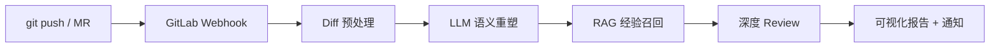

# 业务级 AI Code Review：Webhook 触发 + Diff 语义化 + RAG 经验召回

## TL;DR

- 核心业务 Code Review 的痛点是 **Diff 过大**、**历史事故知识难传承**、**通用 AI 不懂业务**——目标是打造有记忆、懂业务、看过线上事故的评审助手。
- 推荐 **GitLab Webhook 事件驱动**（Push / MR 事件 + 可选构建 Hook），开发者照常 `git push` 即可触发，接入成本极低。
- 原始 Diff 不能直接喂模型：需 **过滤非逻辑文件 → 切片 → 补全方法上下文 → LLM 语义重塑**（先问「这段代码在做什么」），再进入 RAG 与深度 Review。
- **RAG 经验召回**：事故复盘、最佳实践等结构化 Chunk 向量化；用变更语义检索 Top-K（实践取前 2 条），相似代码打标并注入 Prompt。
- 长 Diff 用 **路径权重 + ~30k 安全分片 + 并发 API + reportStore 聚合**；已知问题包括 RAG 误报（建议相似度阈值 ≥0.85）与建议难一键采纳。
- 未来方向：**Cursor CLI 侧边栏采纳**、**发布流水线卡点**、误报反馈闭环调优检索策略。

## 适用场景

**何时用：**

- 核心业务的 GitLab 项目，MR 合入主干前需要质量守卫，且团队有历史事故复盘文档可沉淀。
- Diff 体量大、评审人力不足，希望 AI 结合**业务上下文**给出可操作建议（而非泛泛 lint）。
- 已具备或计划建设内部 AI 平台（Embedding + 向量库 + 模型网关）。

**何时不用：**

- 小团队、变更量少、无历史知识库——直接通用 AI Review 或人工 CR 可能更划算。
- 开源/无 GitLab 场景——需改写触发层（GitHub App、本地 pre-push hook 等），本文链路以 GitLab Webhook 为 SSOT。
- 仅需要风格/格式检查——eslint、Sonar、常规静态分析即可，不必上 RAG 全链路。

## 知识要点

### 1. 业务级 CR 要解决的三件事

| 痛点 | 表现 | 设计应对 |
|------|------|----------|
| Diff 太多 | 评审看不完、注意力分散 | 预处理过滤 + 切片 + 权重 prioritization |
| 知识断层 | 类似 Bug 复发，新人不知、老人忘 | RAG 召回历史复盘与最佳实践 |
| AI 不懂业务 | 建议空泛、不可执行 | 语义重塑 + 业务知识注入 + 事故模式打标 |

核心理念：**把团队踩过的坑，变成模型的直觉**——不是替代人，而是守合入前的最后一道门。

### 2. 端到端链路（从 git push 开始）



**阶段职责**：

1. **触发**：接收 Push / MR 事件（及可选构建 Hook）
2. **预处理**：净化 Diff、切片、补全逻辑上下文
3. **语义理解**：模型归纳变更意图（非直接审计）
4. **经验召回**：向量检索相关历史案例
5. **深度 Review**：融合 Diff + 语义摘要 + 召回知识 → 最终 Prompt
6. **交付**：可视化报告 + 消息通知开发者/评审者

### 3. 触发机制：GitLab Webhook 事件驱动

**产品问题**：什么时候介入才不打扰人？

**选型结论**：GitLab Webhook，无需本地插件或脚本。

| 配置项 | 说明 |
|--------|------|
| 事件类型 | `Push events`、`Merge request events` |
| 回调地址 | 审核服务统一 URL |
| 代码驱动 | 目标为主分支的 MR，或已有 MR 的增量提交 |
| 工程管控 | 构建平台 Hook，特定业务分支在构建环节手动/自动触发 |

优势：接入成本低，与开发者现有 `push` 习惯一致。

### 4. Diff 深度预处理与语义重塑

Webhook 收到的是带 `+`/`-` 的原始 Diff，含冗余符号与非逻辑变更；直接投喂浪费上下文且分散模型注意力。

**预处理流水线**：

| 步骤 | 动作 |
|------|------|
| 特征过滤 | 剔除 `.lock`、`.json`、样式、静态资源等 |
| 切片化 | 先按文件切；单文件过大再按行数/chunk 二次切 |
| 深度提取 | 拉取完整 Context，识别逻辑改动，剔除干扰 |
| 补全逻辑 | 对逻辑改动附带**整个方法的原始实现** |
| 语义重塑 | LLM 任务：「告诉我这段代码在做什么？」（不要求此时审计） |

语义重塑为后续 **RAG 匹配** 与 **深度 Review** 提供变更意图摘要，而非跳过理解直接挑毛病。

### 5. RAG「经验召回」引擎

**知识库数字化**：

- **来源**：历史事故复盘、通用工具库、最佳业务实践、项目技术文档
- **流程**：结构化 Chunk → Embedding → 存入内部 AI 平台向量库

**在线检索**：

1. 以代码变更语义摘要作为查询，同样 Embedding
2. 向量空间 **余弦相似度** 检索，取相关性最高 **前 2 条**（实践配置）
3. **代码打标**：与历史问题相似的逻辑注入 Prompt（如「与某次事故模式相似度 85%」）

效果：缩小人工审计盲区，**老事故复发率明显下降**——评审者获得「为什么现在要警惕」的上下文。

### 6. 深度 Review 与报告通知

**最终 Prompt 上下文包** = 原始 Diff（预处理后）+ 语义简要 + RAG 召回的历史问题。

输出：

- 结构化评审意见
- **可视化报告**（非纯文本墙）
- 消息通知触达相关开发者

### 7. 长 Diff 与性能优化

**非核心文件筛选**：

- 删除文件过滤
- 扩展名排除：`.json`、`.png`、`.lock`、`.css`、`.scss`、`.less` 等
- **路径权重**：`coreDirs` 配置 + `calculateWeight(change)`，优先核心逻辑目录

**分片策略**：

- 粗估累计超过安全余量（实践 **~30000** 上下文单位）时新建 Chunk
- 每 Chunk 含文件列表、变更元信息、平均权重

**并发与聚合**：

```typescript
// 并行处理各 Chunk，提升时效
await Promise.all(chunks.map((chunk) => this.callAPI(params)));

// reportStore 缓存分块结果，全部完成后聚合推送
const isAllChunksDone = (reportStore, report_id, chunksLen) => {
  const expected = reportStore[report_id]?.chunks.length || 0;
  return chunksLen === expected;
};
```

### 8. 模型选型与持续进化

模型无永久最优解，需持续三件事：

| 维度 | 做法 |
|------|------|
| 多维选型 | 用内部模型审核平台 + 预设案例给各模型打分 |
| 闭环反馈 | 抽检 Review 结果，结合用户修正行为评估输出 |
| 动态调优 | 定期检查模型版本，优化 Prompt 策略 |

### 9. 实践问题与未来规划

**RAG 噪音与幻觉**：

- 语义检索可能召回「似是而非」案例，导致误报
- **优化**：相似度 **< 0.85 过滤**；开发者标记误报 → 反馈学习微调检索

**建议难一键采纳**：

- 现状：建议在报告中，无法直接合入 MR
- **优化**：输出可运行修复代码或多方案供选；同步为 **MR 评论**；结合 **Cursor CLI** 将反馈嵌入编辑器侧边栏一键修复

**发布平台集成**：

- 将审计结果作为发布流水线**卡点条件**

## 代码 / 命令

### GitLab Webhook 配置要点

```text
项目或组织 Settings → Webhooks
- Trigger: Push events, Merge request events
- URL: https://{review-service}/webhook/gitlab
- 签名校验密钥: （按需配置 Webhook 校验）
```

### Diff 权重与分片（示意）

```typescript
class DiffProcessor {
  private readonly coreDirs: readonly string[] = [] as const;
  private readonly baseWeight = 1;
  private pathWeightCache = new Map<string, number>();

  private calculateWeight(change: Change): number {
    // 核心目录加权，静态资源降权
    return this.baseWeight;
  }

  private groupIntoChunks(changes: Change[]): Chunk[] {
    const chunks: Chunk[] = [];
    let currentChunk: ChunkData[] = [];
    // 累计超 ~30000 安全余量时 createChunk 并开新片
    if (currentChunk.length > 0) {
      chunks.push(this.createChunk(currentChunk));
    }
    return chunks;
  }
}
```

### 深度 Review Prompt 骨架

```text
## 变更语义（预处理产出）
{semantic_summary}

## 相关历史经验（RAG Top-2，相似度 ≥ 0.85）
{retrieved_incidents}

## 代码 Diff（已过滤与补全方法上下文）
{processed_diff}

请基于业务上下文审查：
1. 是否复现已知事故模式
2. 逻辑边界与异常路径
3. 可执行的修复建议（附代码片段）
```

## 注意事项

- 本文为**内部实践**分享（GitLab + 内部 AI 平台），落地时需替换为自有向量库、模型网关与通知渠道。
- RAG 召回条数（Top-2）与相似度阈值（0.85）需按业务调参；过少漏报，过多误报。
- 语义重塑阶段**不要**与最终审计合并为一步——先理解再审查，可降低幻觉与无关建议。
- 「一键采纳」涉及 MR 写权限与安全审计，需与 Code Owner 策略、分支保护规则对齐。
- 避免在知识库入库含密钥的复盘附件；Webhook 签名校验密钥不入库。

## 相关链接

- [GitLab Webhooks 文档](https://docs.gitlab.com/user/project/integrations/webhooks/)
- [Cursor CLI](https://cursor.com/docs/cli/overview)（未来侧边栏集成方向）
- 项目内：暂无同主题笔记；与 DevOps 发布卡点、AI Agent 工具链可后续交叉入库

## 变更记录

| 日期 | 说明 |
|------|------|
| 2026-06-08 | 初稿（ING-20260608-009），整合业务级 AI Code Review 全链路实践 |
